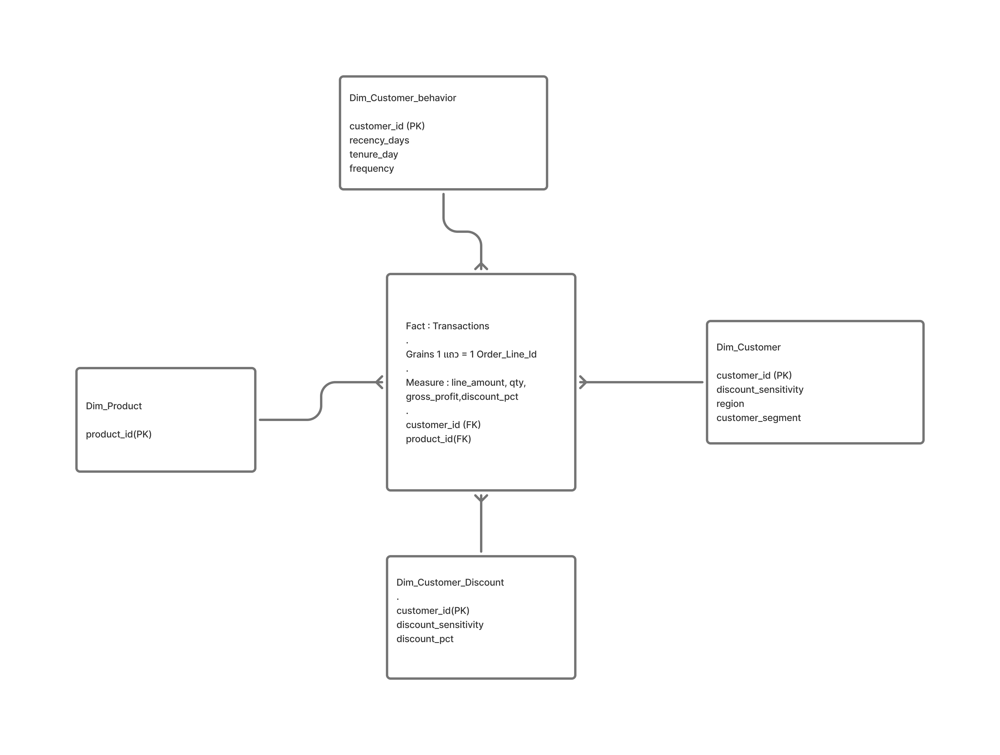
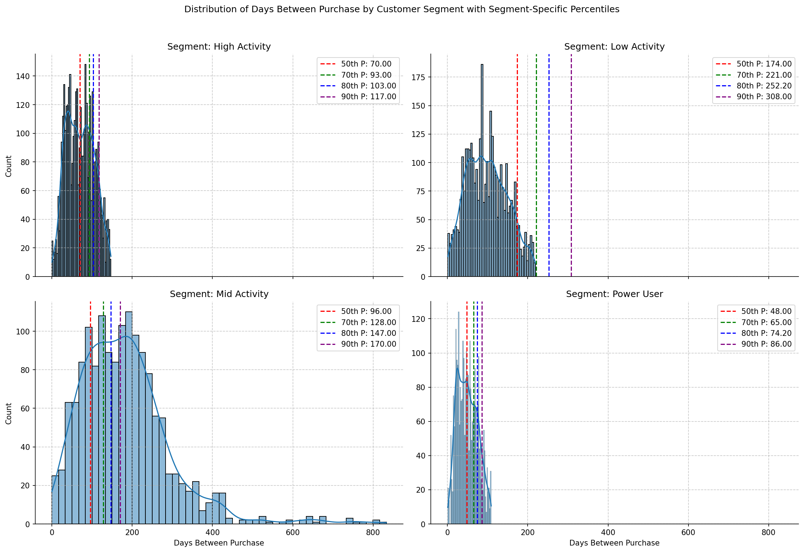
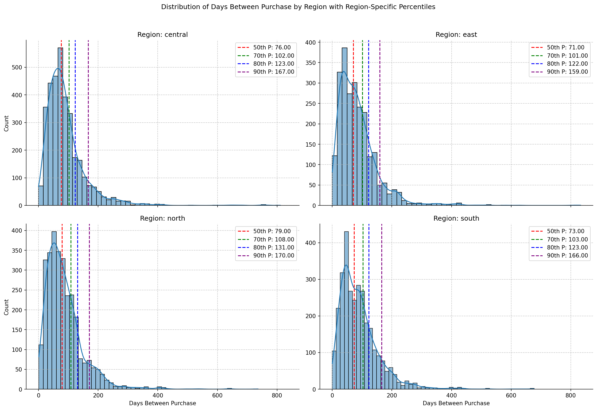
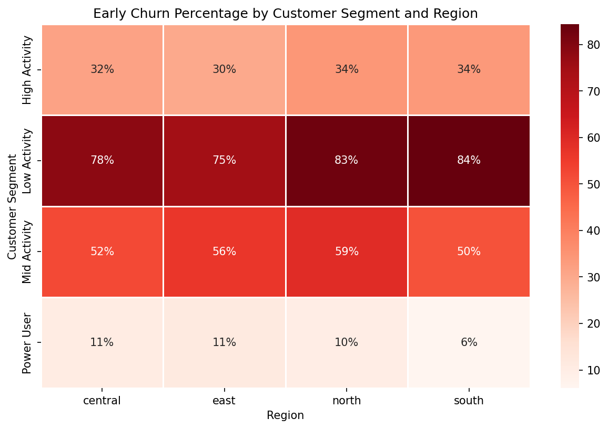
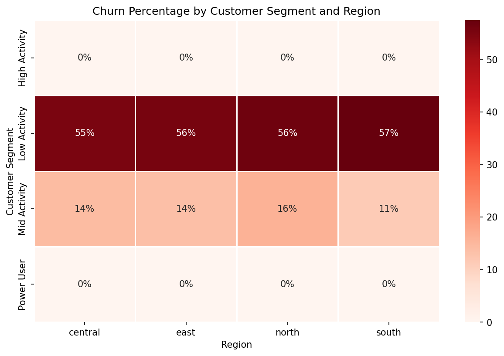

# Customer Behavior Insight Dashboard

Analysis of customer churn and purchase frequency behavior using SQL, Python, and a dimensional data model, visualized in an interactive Power BI dashboard — Data Analytics Bootcamp (Sprint 2, group project).

## Business Problem

- The business relies on repeat purchases, but has no clear view of **which customer segments are at highest risk of churn** or how purchase frequency differs across segments and regions.
- Without this visibility, retention efforts and marketing spend cannot be targeted effectively — the business ends up treating all customers the same, when churn risk actually varies sharply by segment.

## Hypothesis

1. Customer segment (High Activity, Mid Activity, Low Activity, Power User) is associated with different churn rates.
2. Purchase frequency (days between purchases) differs meaningfully by customer segment, more so than by region.

## Data & Tools

- **Tools:** SQL (JOIN, Subquery, CTE), Python (pandas, seaborn, matplotlib), Power BI
- **Data:** Customer transaction records modeled in a Star Schema
- **Data model:**
  - **Fact_Transactions** — grain: 1 row per order line; measures: `line_amount`, `qty`, `gross_profit`, `discount_pct`; keys: `customer_id` (FK), `product_id` (FK)
  - **Dim_Customer** — `customer_id` (PK), `region`, `customer_segment`, `discount_sensitivity`
  - **Dim_Customer_behavior** — `customer_id` (PK), `recency_days`, `tenure_day`, `frequency`
  - **Dim_Customer_Discount** — `customer_id` (PK), `discount_sensitivity`, `discount_pct`
  - **Dim_Product** — `product_id` (PK)

## Approach

1. Modeled customer transaction data into a Star Schema (above) to support efficient, structured querying
2. Wrote SQL to extract and quality-check transaction and customer data before analysis
3. Calculated **days between purchase** per customer and examined its distribution overall, and split by segment and region
4. Defined churn using percentile-based thresholds on days-between-purchase (80th percentile = "churned", 50th percentile = "early churn") and compared churn rates across segment x region
5. Visualized results with seaborn heatmaps and distribution plots, then brought key metrics into an interactive Power BI dashboard

## Key Insight

**Purchase frequency splits cleanly by segment, not by region:**

- Median days-between-purchase ranges from 48 days (Power User) to 174 days (Low Activity) — a ~3.6x gap
- By contrast, the median across regions is nearly flat (71-79 days):

- **Conclusion:** customer segment, not geography, is the meaningful driver of purchase frequency — retention strategy should be segmented by behavior, not rolled out uniformly by region

**Churn risk is concentrated almost entirely in one segment:**

- Early-churn rate: Low Activity 75-84% vs. Power User only 6-11% — consistent across all four regions
- Using a stricter 80th-percentile churn threshold, the gap is even sharper: Low Activity ~55-57% vs. High Activity and Power User both ~0%:

- **Conclusion:** Low Activity customers are the clear priority for retention intervention — the risk is not evenly spread across the customer base, and region does not meaningfully change the picture

## Dashboard

<!-- Add dashboard screenshot here, e.g.  -->

## Links

- [Notebook (churn & purchase frequency analysis)](#) <!-- add link once .ipynb is uploaded to the repo -->
